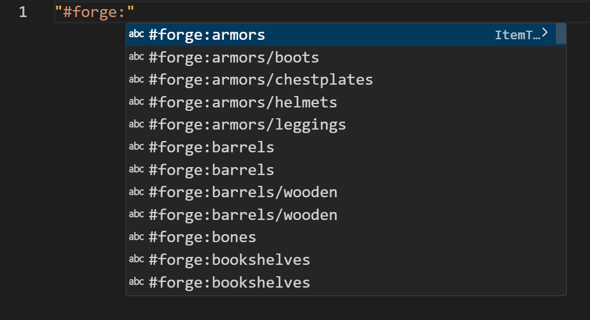

# kubejs-item-completion

A helper extension for KubeJS. This extension allows you to edit javascript files with item/block/fluid identifiers and tags completion.

## Features

When you press `"` in a javascript file, the extension will show you a list of item/block/fluid identifiers and tags that you can use in your scripts.

## Extension Settings

The default vocabulary contains all item/block/fluid identifiers and tags in forge minecraft 1.20.1. If you want to customize the vocabulary, follow these steps:

- Download ["Dump Everything"](https://github.com/LeoDreamer2004/DumpEverything) mod.
- Run your game with the mod installed, and type `/dump` in the chat.
- Open the generated `vocabulary.json` file (in `{$modpack}/dump` folder).
- Hold `Ctrl + Shift + P` to open the command palette, and type `Edit Minecraft Vocabulary`.
- Copy the generated file to the extension vocabulary file, and then restart the editor.

## Release Notes

### 0.0.1

Initial release of the extension, with support for item/block/fluid identifiers and tags completion.
